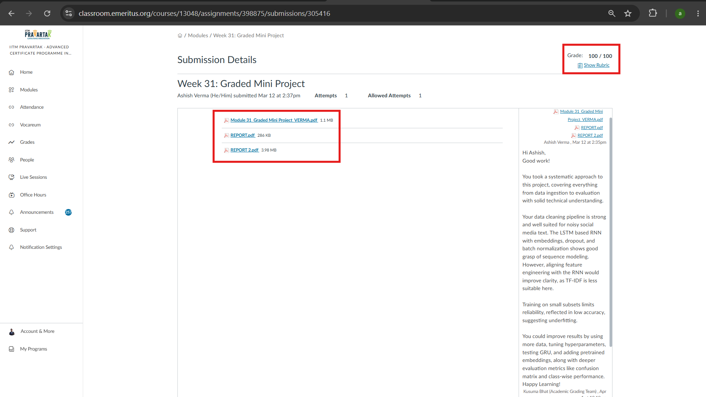

# Deep Learning for Sentiment Analysis: LSTM Networks

An academic deep learning project completed as part of the Advanced Certification Program in Applied Artificial Intelligence and Machine Learning at IITM Pravartak. This repository showcases an end-to-end Natural Language Processing (NLP) workflow, demonstrating competencies in text normalization, sequence modeling, and neural network optimization to classify social media sentiment.

### 🏆 Academic Evaluation
**Grade: 100 / 100**

This graded mini-project received a perfect score. Reviewer feedback highlighted the strong data cleaning pipeline tailored for noisy social media text and the excellent grasp of sequence modeling demonstrated by the LSTM architecture with embeddings and batch normalization.

 

### Project Objective
The primary objective of this project is to build a robust Recurrent Neural Network (RNN) capable of classifying Twitter posts into three sentiment categories: Positive, Negative, or Neutral. By translating unstructured text into sequential numerical data, this project models real-world deep learning pipelines used for brand monitoring and automated customer service analytics.

### Core Competencies Demonstrated
* **NLP Data Preprocessing:** Implementing Regex-based text cleaning (removing URLs, mentions, hashtags) and applying NLTK for stopword removal and Porter stemming.
* **Text Vectorization:** Utilizing TensorFlow/Keras Tokenizers to map a 10,000-word vocabulary and standardizing inputs via sequence padding.
* **Deep Learning Architecture:** Designing Sequential RNN models utilizing 128-dimensional Embedding layers and Long Short-Term Memory (LSTM) units.
* **Model Regularization & Tuning:** Preventing overfitting through Dropout layers (0.3), Batch Normalization, and optimizing hyperparameters via Grid Search and K-Fold Cross Validation.

### Methodology & Analytical Approach
The analytical pipeline was executed across four structured phases:

**Phase 1: Exploratory Data Analysis & Lexical Profiling**
* Conducted frequency distribution analysis, revealing a slight negative bias (30.5%) in the dataset dominated by complaint-oriented vocabulary.
* Visualized linguistic separation utilizing Matplotlib word clouds and isolated feature relationships by analyzing tweet length distributions across sentiment classes.

**Phase 2: Data Cleaning & Feature Engineering**
* Filtered a raw dataset of 73,996 records, stripping duplicates and null values to yield a refined corpus of 69,491 clean tweets.
* Transformed unstructured text into sequential integer matrices, capping sequence lengths at 50 tokens to balance memory efficiency with contextual integrity.
* Applied categorical one-hot encoding to target sentiment variables.

**Phase 3: RNN Model Training**
* Architected a deep learning model featuring ~1.42 million parameters.
* Partitioned data into an 80/20 train-test split, training the network over 5 epochs using the Adam optimizer and categorical cross-entropy loss.

**Phase 4: Evaluation & Performance**
* The finalized LSTM model achieved an **88.1% Test Accuracy**, vastly outperforming the 33% random probability baseline.
* Generated classification reports demonstrating balanced precision and recall, yielding a Macro F1-score of 0.88 across all sentiment classes.

### Repository Contents
This repository serves as an academic portfolio piece documenting the project requirements and the finalized submissions. 
* **`Week 31_Task to be performed.pdf`**: The official project specifications and task framework.
* **`REPORT.pdf`**: The comprehensive technical report detailing data distribution insights, architecture configurations, and classification metrics.
* **`REPORT 2.pdf`**: An executive summary and presentation highlighting business value, key takeaways, and model inferences.
* **`Module 31_Graded Mini Project_VERMA.pdf`**: The complete computational report containing all Python code blocks, NLP pipelines, and TensorFlow/Keras model executions.

### Technical Stack
* **Programming Language:** Python 3
* **Deep Learning Framework:** TensorFlow, Keras
* **NLP Libraries:** NLTK, Regular Expressions (re)
* **Data Manipulation & Visual Analytics:** Pandas, NumPy, Matplotlib, Seaborn, WordCloud
